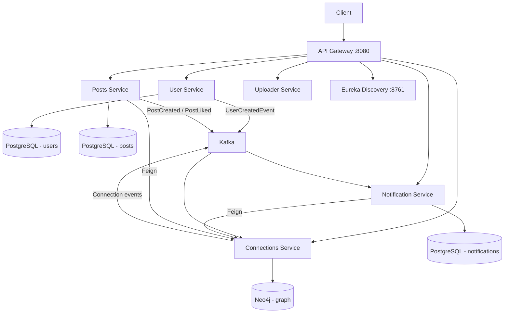

# LinkedIn Microservices App

A distributed backend inspired by LinkedIn, built with **Spring Boot 3**, **Spring Cloud**, **Kafka**, **PostgreSQL**, **Neo4j**, and **Docker**.

## Architecture



### Services

| Service | Port | Database | Responsibility |
|---------|------|----------|----------------|
| API Gateway | 8080 | — | Routing, JWT auth, correlation IDs |
| Discovery Server | 8761 | — | Eureka service registry |
| User Service | 9020 | PostgreSQL | Signup, login, JWT issuance |
| Posts Service | 9010 | PostgreSQL | Posts, likes, connection feed |
| Connections Service | 9030 | Neo4j | Connection requests & graph |
| Notification Service | 9040 | PostgreSQL | Async notifications inbox |
| Uploader Service | 9050 | Cloudinary/GCS | File uploads |

## Features

- **Database-per-service** with polyglot persistence (PostgreSQL + Neo4j)
- **Event-driven** notifications via Kafka
- **JWT authentication** at API Gateway with `X-User-Id` propagation (see [Security model](#security-model))
- **Request validation** on signup, login, and post creation (`@Valid` + Bean Validation)
- **User signup sync** — `UserCreatedEvent` auto-creates Neo4j `Person` nodes
- **Connection feed** — `GET /api/v1/posts/core/feed`
- **Notification inbox** — `GET /api/v1/notifications/core/inbox`
- **OpenAPI docs** on each service at `/swagger-ui.html`
- **Docker Compose** for local deployment
- **Kubernetes** manifests in `k8s/`
- **GitHub Actions CI** builds and tests all services

## Quick Start

### Prerequisites

- Docker & Docker Compose
- Java 21 + Maven (for local development without Docker)

### Run with Docker Compose

```bash
cp .env.example .env
docker compose up --build
```

Wait for all services to start, then verify Eureka at http://localhost:8761 and Kafka UI at http://localhost:8090.

### Sample API Flow

**1. Sign up**

```bash
curl -X POST http://localhost:8080/api/v1/users/auth/signup \
  -H "Content-Type: application/json" \
  -d '{"name":"Alice","email":"alice@example.com","password":"secret123"}'
```

**2. Log in**

```bash
curl -X POST http://localhost:8080/api/v1/users/auth/login \
  -H "Content-Type: application/json" \
  -d '{"email":"alice@example.com","password":"secret123"}'
```

Save the returned JWT token.

**3. Create a post**

```bash
curl -X POST http://localhost:8080/api/v1/posts/core \
  -H "Authorization: Bearer <TOKEN>" \
  -H "Content-Type: application/json" \
  -d '{"content":"Hello LinkedIn!"}'
```

**4. Get your feed**

```bash
curl http://localhost:8080/api/v1/posts/core/feed \
  -H "Authorization: Bearer <TOKEN>"
```

**5. Send a connection request**

```bash
curl -X POST http://localhost:8080/api/v1/connections/core/request/2 \
  -H "Authorization: Bearer <TOKEN>"
```

**6. View notifications**

```bash
curl http://localhost:8080/api/v1/notifications/core/inbox \
  -H "Authorization: Bearer <TOKEN>"
```

## API Endpoints (via Gateway)

| Method | Path | Auth | Description |
|--------|------|------|-------------|
| POST | `/api/v1/users/auth/signup` | No | Register |
| POST | `/api/v1/users/auth/login` | No | Login, returns JWT |
| POST | `/api/v1/posts/core` | Yes | Create post |
| GET | `/api/v1/posts/core/feed` | Yes | Feed from connections |
| GET | `/api/v1/posts/core/{postId}` | Yes | Get post |
| POST | `/api/v1/posts/likes/{postId}` | Yes | Like post |
| GET | `/api/v1/connections/core/first-degree` | Yes | List connections |
| POST | `/api/v1/connections/core/request/{userId}` | Yes | Send request |
| POST | `/api/v1/connections/core/accept/{userId}` | Yes | Accept request |
| GET | `/api/v1/notifications/core/inbox` | Yes | Notification inbox |
| POST | `/api/v1/uploads/file` | Yes | Upload file |

## Security model

Authentication is enforced at the **API Gateway**:

1. Client sends `Authorization: Bearer <JWT>` on protected routes.
2. Gateway validates the JWT and injects `X-User-Id` on the downstream request.
3. Posts, connections, and notification services **require** `X-User-Id` and return `401` if it is missing or invalid.

**Important:** Downstream services trust `X-User-Id` only when traffic comes through the gateway. In production, use network policies (Docker/Kubernetes) so service ports are not exposed publicly without the gateway.

| Layer | Responsibility |
|-------|----------------|
| Gateway | JWT validation, correlation IDs |
| Domain services | Require `X-User-Id`, business rules |
| Kafka | Async events between services |

Set `JWT_SECRET_KEY` (min 32 characters) in `.env` / deployment — never rely on the dev default in production.

## Configuration

Set environment variables via `.env` (see `.env.example`):

| Variable | Description |
|----------|-------------|
| `JWT_SECRET_KEY` | Shared secret for JWT signing (min 32 chars) |
| `CLOUDINARY_*` | Optional Cloudinary credentials for uploader |
| `GCS_*` | Optional Google Cloud Storage credentials |

Without cloud storage credentials, the uploader service returns mock local URLs for development.

## Local Development (without Docker)

Start infrastructure only:

```bash
docker compose up kafka posts-db user-db notification-db connections-db discovery-server
```

Then run each service with Maven from its directory:

```bash
./mvnw spring-boot:run
```

## OpenAPI / Swagger

When running a service directly:

- User Service: http://localhost:9020/users/swagger-ui.html
- Posts Service: http://localhost:9010/posts/swagger-ui.html
- Connections Service: http://localhost:9030/connections/swagger-ui.html
- Notification Service: http://localhost:9040/notifications/swagger-ui.html

## Project Structure

```
linkedInApp/
├── api-gateway/
├── discovery-server/
├── user-service/
├── posts-service/
├── connections-service/
├── notification-service/
├── uploader-service/
├── k8s/
├── docker-compose.yml
└── .github/workflows/ci.yml
```

## Testing

Run all tests:

```bash
cd user-service && ./mvnw test
# repeat for each service, or use CI
```

| Layer | Coverage |
|-------|----------|
| **Unit tests** | Services, consumers, JWT, password hashing |
| **WebMvc tests** | REST controllers (auth, posts, connections, notifications, upload) |
| **Gateway tests** | JWT auth filter, correlation ID filter |
| **Integration tests** | Full signup → login flow in user-service (H2, no Docker) |

**50+ test methods** across 7 services. Tests use Mockito + `@WebMvcTest` with H2/in-memory config (no Docker required for CI).

CI runs on every push/PR via `.github/workflows/ci.yml` (matrix build across all 7 services).

## Tech Stack

- Java 21, Spring Boot 3.3, Spring Cloud 2023
- Spring Cloud Gateway, Netflix Eureka, OpenFeign
- Apache Kafka, PostgreSQL, Neo4j
- Docker, Kubernetes, GitHub Actions
- JWT (jjwt), BCrypt, Lombok, ModelMapper, SpringDoc OpenAPI

## License

Educational / portfolio project.
